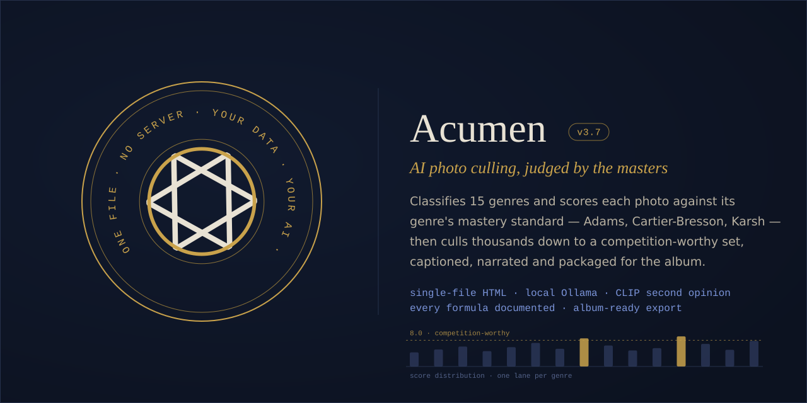

<p align="center">
  
</p>
Acumen — AI-First Photo Culling
One HTML file that culls thousands of photographs down to a competition-worthy
selection — with the AI judging each image against the mastery standard of its
genre. A landscape is measured against Ansel Adams' tonal command; a street
photo against Cartier-Bresson's decisive moment; a portrait against Karsh and
McCurry; a still life against Weston's Pepper No. 30. Fifteen genres, each
with its own legend-anchored rubric — and an explicit anti-mimicry guard so the
AI rewards principles, never black-and-white nostalgia or imitation of a
famous look.
> ▶ **Try it live:** *(enable GitHub Pages, then link the file here)*
> Or download `Acumen_v3.2.html`, open it in Chrome/Edge, and point it at a folder.
How it works
```
Import folder  →  Pre-filter (broken files only)  →  Perceptual dedup (pHash + Bhattacharyya)
→  AI genre classification + master-anchored scoring  →  Auto-select top N  →  Copy to folder
```
Two scoring modes:
Mode	Passes	Use for
Quick	1 — combined classify + score	Triage of 1,500+ images
Competition	4 — describe+classify → criterion scoring (geometric mean) → temporal dedup → margin refinement (median-of-3 at the selection cutoff)	Final competition / portfolio selection
The four-pass competition mode mirrors how juries actually work: scores are
combined by geometric mean (a fatal flaw can't be bought back by strengths
elsewhere), and images near the top-N cutoff are re-scored twice more with the
median of three kept — because AI scoring noise only matters at the
decision boundary.
Nothing is a black box
Every formula is defined and explained in the built-in wiki: the DCT-II
perceptual hash construction, Hamming-distance thresholds, the Bhattacharyya
coefficient used for color confirmation, the AM–GM argument for the geometric
mean, star-rating thresholds, and the statistical case for margin refinement.
The full genre-to-master crosswalk — anchor, epitome work, and distilled
principle for all fifteen genres — is documented in Wiki → Master-Anchored
Scoring.
Privacy
Runs entirely in your browser from a single file. No server, no account, no telemetry.
With Ollama (local, recommended — a gemma-class vision model), no image ever leaves your machine. Cloud providers (Anthropic, Groq, Gemini, OpenAI) are optional, bring-your-own-key.
External resources, disclosed honestly: the file loads the Inter typeface from Google Fonts and the jsPDF library from cdnjs at startup, and contacts only the AI endpoint you configure. That is the complete list.
One-click export
The 📂 Copy to Folder button copies your entire culled selection directly
to any destination (Chrome/Edge, File System Access API) into a timestamped
subfolder, with a `_acumen_manifest.csv` carrying every image's score, genre,
five criterion values, and AI narrative — your selection rationale travels
with the photos. Other browsers fall back to a generated .bat copy script.
Requirements
Chrome or Edge recommended (File System Access API for direct copy)
For local AI: Ollama with a vision-capable model (~10 GB VRAM for a 12B model; setup wizard included in-app)
Part of the Sovereign Apps family
Built on the same architecture as
Rosetta HTM™ and
Retirement Operating System™:
single file, no build step, local-first data, AI provider neutrality,
documentation as a first-class artifact.
<p align="center">
  <sub><i>one file · no server · your data · your AI</i></sub>
</p>
